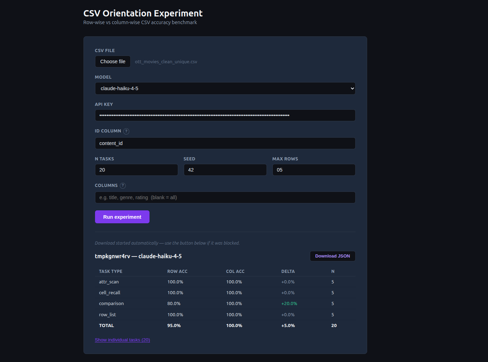

# OrientBench

## What it does

Measures whether LLMs answer questions about tabular data more accurately when a CSV is presented in **row-wise** (standard) vs **column-wise** (transposed) format.

Each task is sent to the model twice — once per orientation — and scored independently. The delta is directly attributable to layout, not question difficulty.

## Orientations

**Row-wise** (standard)
```
content_id,title,type
C100271,Neon Streets,Movie
C101244,Dark Signal,Series
```

**Column-wise** (transposed)
```
content_id,C100271,C101244
title,Neon Streets,Dark Signal
type,Movie,Series
```

## Task types

| Type | Question | Scoring |
|---|---|---|
| `cell_recall` | What is the `{col}` of `{entity}`? | Exact match (normalised) |
| `attr_scan` | Which `{id_col}` has `{col}` equal to `{value}`? | Exact match |
| `comparison` | Which `{id_col}` has the highest `{col}`? | Exact match |
| `row_list` | List all attributes of `{entity}` as key=value pairs. | Subset match (order-independent) |

Tasks cycle round-robin through all four types. Each task receives its own randomly sampled slice of context rows.

## Supported models

| Model | Provider |
|---|---|
| `claude-haiku-4-5` | Anthropic (Batch API) |
| `claude-haiku-4-5-20251001` | Anthropic (Batch API) |
| `claude-sonnet-4-6` | Anthropic (Batch API) |
| `claude-opus-4-8` | Anthropic (Batch API) |
| `gpt-4o-mini` | OpenAI (Batch API) |
| `gpt-4o` | OpenAI (Batch API) |
| `gpt-5.4-mini` | OpenAI (Batch API) |
| `gpt-5.4` | OpenAI (Batch API) |
| `gpt-5.5` | OpenAI (Batch API) |
| `qwen2.5:3b` | Ollama (local) |
| `qwen3:8b` | Ollama (local) |
| `llama3:8b` | Ollama (local) |

## Setup

```bash
python -m venv .venv
source .venv/bin/activate
pip install -e ".[dev]"
```

Add API keys to `.env`:

```bash
ANTHROPIC_API_KEY=sk-ant-...
OPENAI_API_KEY=sk-...
```

## Web UI



Start the backend:

```bash
uvicorn src.api:app --reload
```

Start the frontend:

```bash
cd frontend
npm install
npm run dev
```

Open `http://localhost:5173`. Upload a CSV, choose a model, enter your API key, and run. Results download automatically as JSON when the run completes.

### Recovering results

Batch runs (Anthropic, OpenAI) can take minutes. If you lose your session:

| Situation | Recovery |
|---|---|
| Browser refreshed mid-run | Polling resumes automatically on reload — the run ID is saved in `localStorage` and results survive up to 2 hours on the backend |
| Auto-download completed but you closed the tab | Use **"Load a saved results file"** in the Recover results panel to re-display the downloaded JSON |
| Download was never triggered (closed before run finished) | Use **"Re-parse raw batch results from provider"**: download the raw JSONL from the [Anthropic console](https://console.anthropic.com) → Batches, or the OpenAI dashboard → Batch jobs, then upload it along with the original CSV using the same run parameters (n, seed, id column) |

## CLI

```bash
python -m src.run \
  --model claude-haiku-4-5 \
  --id-col content_id \
  --n 50 \
  --max-rows 10 \
  --cols title,genre,rating \
  data/raw/ott_movies_subset.csv
```

| Flag | Default | Description |
|---|---|---|
| `--model` | required | Model name (must be in `models.json`) |
| `--id-col` | required | Column used as entity identifier |
| `--n` | 20 | Number of tasks |
| `--seed` | 42 | Random seed |
| `--max-rows` | 15 | Max context rows per task |
| `--cols` | all | Comma-separated columns to include |

Results are written to `results/{dataset}_{timestamp}.json`.

## Viewing results

```bash
python -m src.report results/*.json
```

```
dataset             model           task_type    row_acc  col_acc   delta     n
------------------------------------------------------------------------------------
ott_movies_subset   claude-haiku-4-5  attr_scan   80.0%    72.0%   -8.0%    50
ott_movies_subset   claude-haiku-4-5  cell_recall 96.0%    88.0%   -8.0%    50
ott_movies_subset   claude-haiku-4-5  comparison  84.0%    76.0%   -8.0%    50
ott_movies_subset   claude-haiku-4-5  row_list    72.0%    60.0%  -12.0%    50
------------------------------------------------------------------------------------
ott_movies_subset (all)               TOTAL       83.0%    74.0%   -9.0%   200
```

`delta = col_acc − row_acc`. Negative means row-wise performed better.

## Managing the model registry

```bash
python -m src.registry add gpt-4o openai
python -m src.registry add claude-haiku-4-5-20251001 anthropic
python -m src.registry list
python -m src.registry remove gpt-4o
```

Models are stored in `models.json`. The correct runner is selected automatically — no code changes needed.

## Running tests

```bash
pytest
```

No LLM calls are made. The suite covers prompt construction, task generation, scoring, runner mechanics, and the API layer using fixtures and mocks.

## Project structure

```
models.json           Model → provider registry
data/raw/             Input CSV datasets
results/              Output JSON from experiment runs
src/
  api.py              FastAPI backend
  run.py              CLI entry point
  registry.py         CLI to manage models.json
  report.py           Result aggregation and display
  tasks.py            Task generation (4 types)
  prompt.py           Prompt construction (row/col orientations)
  score.py            Answer scoring
  orient.py           CSV formatting utilities
  runners/
    base.py           BaseRunner ABC
    factory.py        RunnerFactory — routes by model name
    anthropic_runner.py  Batch API inference
    openai_runner.py     Batch API inference
    ollama_runner.py     Local inference via Ollama
frontend/             React + Vite web UI
tests/                Unit tests
```

## Data

The sample dataset in `data/` is sourced from Kaggle:

> **OTT Movies and Series Dataset (ML and NLP Ready)**
> https://www.kaggle.com/datasets/amaymishra11/ott-movies-and-series-dataset-ml-and-nlp-ready
